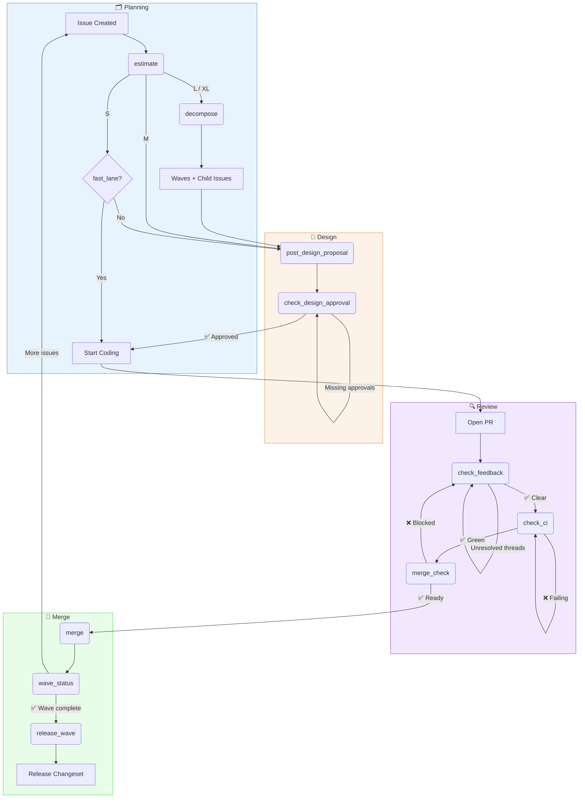
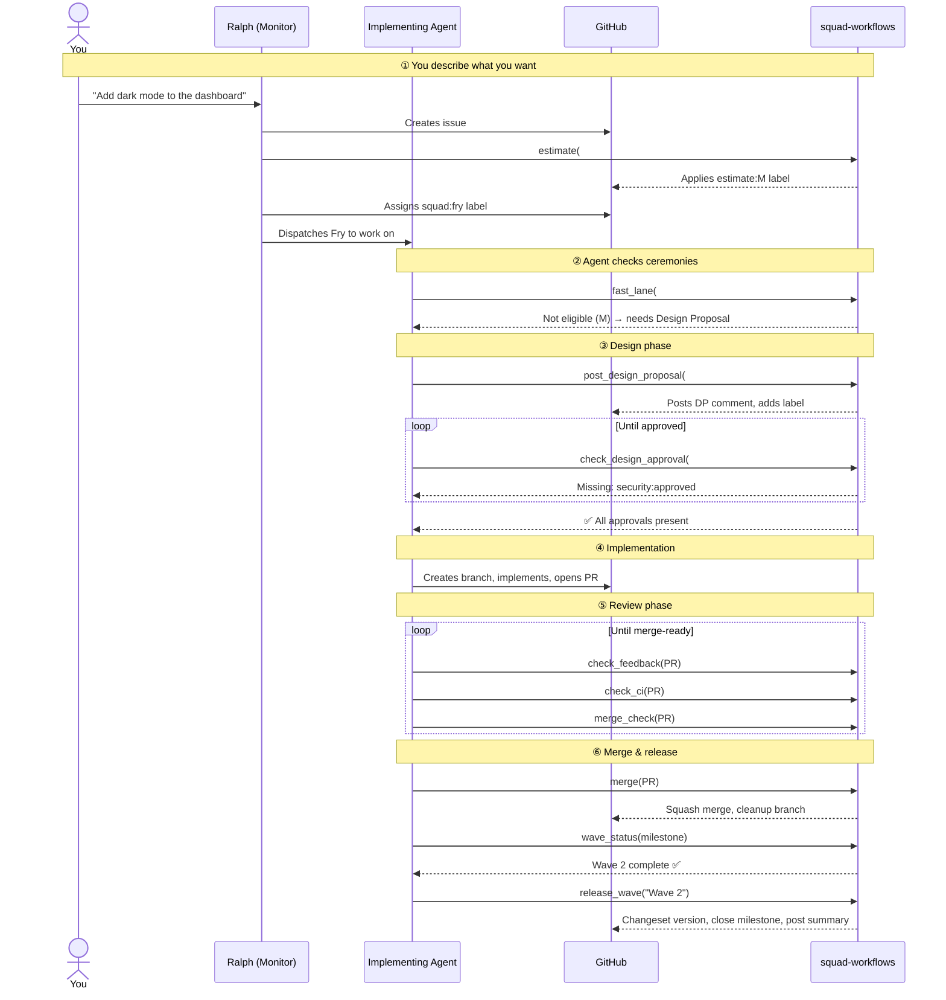

# @sabbour/squad-workflows

[](./LICENSE)

> [!WARNING]
> **Experimental** — This project is under active development. APIs, config schemas, and CLI commands may change without notice.

> Issue-to-merge workflow orchestration for [Squad](https://github.com/bradygaster/squad) agents.

Codifies the entire development lifecycle — from planning and estimation through
design proposals, review ceremonies, merge gates, and wave-based incremental
delivery — as executable Copilot CLI tools.



## How It Works

You don't call these tools manually — **your agents do**.

When you describe a feature to any Squad agent (Copilot CLI, a squad member, or through a GitHub issue), the agent reads the repo's `copilot-instructions.md` and discovers the workflow engine. From that point, every tool call chains automatically: each tool returns a `nextStep` that tells the agent what to do next.

### Entry points

There are three ways work enters the workflow:

| Entry Point | What Happens |
|-------------|-------------|
| **Chat with Copilot CLI** | You describe a feature → agent creates an issue → workflow begins |
| **Chat with Ralph** | You describe work → Ralph creates an issue, triages it, and dispatches to the right agent |
| **GitHub issue created** | Ralph's polling loop detects it → triages → assigns `squad:{member}` → dispatches agent |

All three converge on the same lifecycle. The difference is just who creates the issue.

### The agent loop

Once an issue exists, the implementing agent follows this loop — driven by the workflow tools:



### What Ralph does with squad-workflows installed

Ralph is the **monitor** — a polling loop that scans for work and dispatches agents. With `squad-workflows` installed, Ralph's cycle becomes:

```
┌─────────────────────────────────────────────────────┐
│  Ralph's Polling Loop                               │
│                                                     │
│  1. SCAN     — Fetch open issues and PRs            │
│  2. ESTIMATE — Call estimate on untriaged issues     │
│  3. TRIAGE   — Route to squad:{member} via routing   │
│  4. DISPATCH — Spawn implementing agent              │
│  5. MONITOR  — Call status on in-flight issues       │
│               Call check_feedback on open PRs        │
│               Call check_ci on PRs with new commits  │
│  6. MERGE    — Call merge_check → merge on ready PRs │
│  7. RELEASE  — Call wave_status after merges          │
│               Call release_wave when wave complete   │
│  8. REPORT   — Post summary, loop back to SCAN      │
└─────────────────────────────────────────────────────┘
```

Without `squad-workflows`, Ralph still routes and dispatches — but the agents have no shared protocol for ceremonies, gates, or wave delivery. The workflow tools give every agent the same playbook.

### PR Feedback Loop

When a PR enters the review phase, Ralph and implementing agents orchestrate a **feedback loop** to clear the board — aiming for 0 unresolved threads, 0 failing CI, 0 stale PRs.

The loop follows a 9-step sequence:

1. **Scan** — Fetch unresolved review threads (thread ID, reviewer, file, line, comment)
2. **Prioritize** — Sort threads by blocker severity and assigned reviewer
3. **Fix Code** — Implementing agent batches all related feedback into one implementation pass, validates once, and pushes one commit
4. **Consolidate + Resolve** — Agent posts one consolidated PR update where possible, then replies to and resolves individual threads (`"Addressed in {sha}: {description}"`)
5. **Re-request** — If review was requested from a specific reviewer, re-request it
6. **Merge Gate** — Call `merge_check` to validate all gates (approvals, threads, CI, changeset)
7. **Branch Behind** — If base branch moved, call `update_branch` to sync
8. **Next PR** — After merge, loop to the next open PR
9. **Wave Boundary** — When all PRs in a wave are merged, call `release_wave`

> **Note on identity:** Thread replies use the **PR author's bot identity** (not Ralph's). This is enforced by `squad-identity` to ensure feedback replies are attributed to the agent who wrote the code. Related skills: `pr-feedback-loop`, `reviewer-protocol`, `gh-auth-isolation`, `self-approval-fallback`, `git-workflow`.

### What if I'm working directly?

The CLI works standalone too — useful for manual checks or when you want to drive the process yourself:

```bash
squad-workflows status --issue 87     # Where is this issue in the lifecycle?
squad-workflows estimate --issue 87   # Estimate and label
squad-workflows doctor                # Health check
```

## Install

```bash
npm install -g @sabbour/squad-workflows
```

## Setup

```bash
# One-time setup — installs config, labels, and instruction patches
squad-workflows setup

# Scaffold the changeset release workflow (optional)
squad-workflows scaffold-release
```

### Charter Patching

The `squad-workflows init` and `squad-workflows setup` commands patch **two files**:

1. `.github/copilot-instructions.md` — Injects the Workflow Tools reference section so agents discover the entire toolkit
2. `.squad/agents/ralph/charter.md` — Injects a `<!-- squad-workflows: start/end -->` block containing the PR Feedback Loop protocol (the 9-step playbook Ralph uses to clear the board)

The `squad-workflows doctor` health check verifies both patches are present and current.

## Tools

When installed as a Copilot CLI extension, the following tools are available:

### Setup
| Tool | Description |
|------|-------------|
| `squad_workflows_init` | One-time setup: labels, board columns, config, instruction patches |
| `squad_workflows_doctor` | Health check: config, labels, instructions all present and current |

### Planning
| Tool | Description |
|------|-------------|
| `squad_workflows_estimate` | Analyze issue → auto-apply estimate:S/M/L/XL label with story points |
| `squad_workflows_decompose` | Slice large issue into waves → milestones → child issues |

### Design
| Tool | Description |
|------|-------------|
| `squad_workflows_post_design_proposal` | Post DP comment with subtasks by wave, validate completeness |
| `squad_workflows_check_design_approval` | Check required DR approval labels, report what's missing |

### Review
| Tool | Description |
|------|-------------|
| `squad_workflows_check_feedback` | List unresolved review threads across all reviewers |
| `squad_workflows_address_feedback` | Fetch unresolved review threads for a PR with structured data (thread ID, reviewer, file, line, comment body) |
| `squad_workflows_address_all_feedback` | Address ALL unresolved threads on a PR in one call — orchestrates fix code → reply to each thread → resolve threads |
| `squad_workflows_check_ci` | Check CI status for a PR with actionable failure context |
| `squad_workflows_update_branch` | Merge base branch into a PR's head branch to keep it current |

### Merge
| Tool | Description |
|------|-------------|
| `squad_workflows_merge_check` | Pre-merge validation: approvals + threads + CI + changeset |
| `squad_workflows_merge` | Squash merge + cleanup + wave completion check |
| `squad_workflows_release_wave` | Release a completed wave: validate, version, close milestone, post summary |

### Scaffold
| Tool | Description |
|------|-------------|
| `squad_workflows_scaffold_release` | Generate a manually-dispatched changeset release workflow into `.github/workflows/` |

### Utility
| Tool | Description |
|------|-------------|
| `squad_workflows_fast_lane` | Check if issue qualifies for fast-lane (skip ceremonies) |
| `squad_workflows_board_sync` | Sync project board column based on issue/PR state |
| `squad_workflows_wave_status` | Show wave/milestone progress and releasability |
| `squad_workflows_status` | Current workflow state for an issue: phase, blockers, next step |

## Concepts

### The Lifecycle

Every issue follows the same path. The workflow engine gates progression — an agent can't merge a PR until the design is approved, can't release a wave until all issues are merged.

| Phase | What happens | Who triggers it |
|-------|-------------|-----------------|
| **Planning** | Issue is estimated (S/M/L/XL) and large issues are decomposed into waves | Agent, on issue creation or assignment |
| **Design** | Design Proposal posted, reviewed, and approved by configured reviewers | Agent posts; reviewer agents approve |
| **Code** | Worktree created, implementation done, draft PR opened with changeset | Implementing agent |
| **Review** | PR feedback threads resolved, CI green, merge gates checked | Implementing agent + reviewer agents |
| **Merge** | Squash merge, branch cleanup, wave progress updated | Implementing agent |
| **Release** | Wave completed → changeset versioning → milestone closed → summary posted | Implementing agent or release process |

### Waves

Large features are decomposed into **waves** — independently shippable increments.
Each wave maps to a GitHub milestone and produces a releasable changeset.

```
Feature: "Widget System"
├── Wave 1: Basic Widgets (v0.5.0) — S+S issues
├── Wave 2: Custom Styling (v0.6.0) — M+S issues
└── Wave 3: Gallery View (v0.7.0) — M issue
```

Every wave has **demo criteria** — a sentence describing what's testable after it ships.

### Ceremonies

The workflow enforces these ceremonies (with fast-lane exceptions):

| Ceremony | When | Tools |
|----------|------|-------|
| Planning | Issue assigned | `estimate`, `decompose` |
| Design Proposal | Before coding | `post_design_proposal` |
| Design Review | After DP posted | `check_design_approval` |
| PR Review Gate | Before merge | `check_feedback`, `merge_check` |
| Wave Completion | Last issue in wave merges | `wave_status`, `release_wave` |

### Fast Lane

Issues labeled `estimate:S` or `squad:chore-auto` skip Design Proposal and Design Review.

## Configuration

Config lives at `.squad/workflows/config.json`. Created by `squad-workflows init`.

## Related

`squad-workflows` is part of a family of Squad extensions:

| Package | Purpose |
|---------|---------|
| [`@sabbour/squad-identity`](https://github.com/sabbour/squad-identity) | GitHub App bot-identity governance — every agent write is attributed to a dedicated bot account |
| [`@sabbour/squad-reviews`](https://github.com/sabbour/squad-reviews) | Config-driven review governance — PR/issue routing, feedback threads, review gates |
| **`@sabbour/squad-workflows`** | Issue-to-merge lifecycle — estimation, waves, design ceremonies, merge gates *(this repo)* |

## License

MIT
