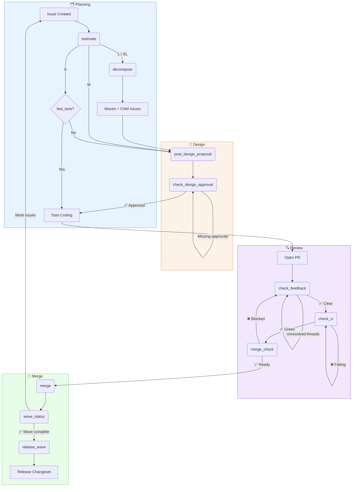

# @sabbour/squad-workflows

[](./LICENSE)

> [!WARNING]
> **Experimental** — This project is under active development. APIs, config schemas, and CLI commands may change without notice.

> Issue-to-merge workflow orchestration for [Squad](https://github.com/bradygaster/squad) agents.

Codifies the entire development lifecycle — from planning and estimation through
design proposals, review ceremonies, merge gates, and wave-based incremental
delivery — as executable Copilot CLI tools.



## Install

```bash
npm install -g @sabbour/squad-workflows
```

## Quick Start

```bash
# One-time setup in your repo
squad-workflows init

# Health check
squad-workflows doctor

# Estimate an issue
squad-workflows estimate --issue 42

# Decompose into waves
squad-workflows decompose --issue 42

# Check workflow status
squad-workflows status --issue 42
```

## Tools

When installed as a Copilot CLI extension, the following tools are available:

### Setup
| Tool | Description |
|------|-------------|
| `squad_workflows_init` | One-time setup: labels, board columns, config, instruction patches |
| `squad_workflows_doctor` | Health check: config, labels, instructions all present and current |

### Planning
| Tool | Description |
|------|-------------|
| `squad_workflows_estimate` | Analyze issue → auto-apply estimate:S/M/L/XL label with story points |
| `squad_workflows_decompose` | Slice large issue into waves → milestones → child issues |

### Design
| Tool | Description |
|------|-------------|
| `squad_workflows_post_design_proposal` | Post DP comment with subtasks by wave, validate completeness |
| `squad_workflows_check_design_approval` | Check required DR approval labels, report what's missing |

### Review
| Tool | Description |
|------|-------------|
| `squad_workflows_check_feedback` | List unresolved review threads across all reviewers |
| `squad_workflows_check_ci` | Check CI status for a PR with actionable failure context |

### Merge
| Tool | Description |
|------|-------------|
| `squad_workflows_merge_check` | Pre-merge validation: approvals + threads + CI + changeset |
| `squad_workflows_merge` | Squash merge + cleanup + wave completion check |
| `squad_workflows_release_wave` | Release a completed wave: validate, version, close milestone, post summary |

### Utility
| Tool | Description |
|------|-------------|
| `squad_workflows_fast_lane` | Check if issue qualifies for fast-lane (skip ceremonies) |
| `squad_workflows_board_sync` | Sync project board column based on issue/PR state |
| `squad_workflows_wave_status` | Show wave/milestone progress and releasability |
| `squad_workflows_status` | Current workflow state for an issue: phase, blockers, next step |

## Concepts

### Waves

Large features are decomposed into **waves** — independently shippable increments.
Each wave maps to a GitHub milestone and produces a releasable changeset.

```
Feature: "Widget System"
├── Wave 1: Basic Widgets (v0.5.0) — S+S issues
├── Wave 2: Custom Styling (v0.6.0) — M+S issues
└── Wave 3: Gallery View (v0.7.0) — M issue
```

Every wave has **demo criteria** — a sentence describing what's testable after it ships.

### Ceremonies

The workflow enforces these ceremonies (with fast-lane exceptions):

| Ceremony | When | Tools |
|----------|------|-------|
| Planning | Issue assigned | `estimate`, `decompose` |
| Design Proposal | Before coding | `post_design_proposal` |
| Design Review | After DP posted | `check_design_approval` |
| PR Review Gate | Before merge | `check_feedback`, `merge_check` |
| Wave Completion | Last issue in wave merges | `wave_status`, `release_wave` |

### Fast Lane

Issues labeled `estimate:S` or `squad:chore-auto` skip Design Proposal and Design Review.

## Configuration

Config lives at `.squad/workflows/config.json`. Created by `squad-workflows init`.

## Related

`squad-workflows` is part of a family of Squad extensions:

| Package | Purpose |
|---------|---------|
| [`@sabbour/squad-identity`](https://github.com/sabbour/squad-identity) | GitHub App bot-identity governance — every agent write is attributed to a dedicated bot account |
| [`@sabbour/squad-reviews`](https://github.com/sabbour/squad-reviews) | Config-driven review governance — PR/issue routing, feedback threads, review gates |
| **`@sabbour/squad-workflows`** | Issue-to-merge lifecycle — estimation, waves, design ceremonies, merge gates *(this repo)* |

## License

MIT
